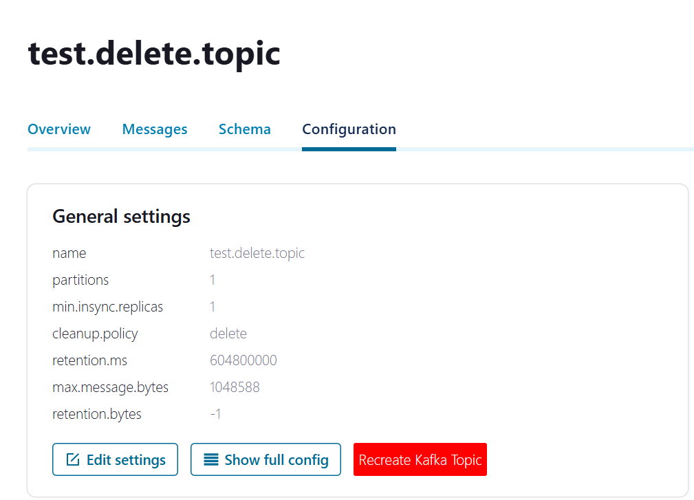

# confluent-kafka-msg-delete-tampermonkey
Tampermonkey script designed to interact with the Confluent Kafka REST API, enabling the management of Kafka topics by allowing users to delete and recreate topics in single button.
 
# Requirements:
- Tampermonkey extension
- chrome://extensions (Developer Mode Enabled)

# Example

